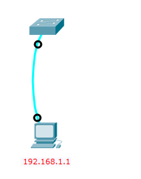
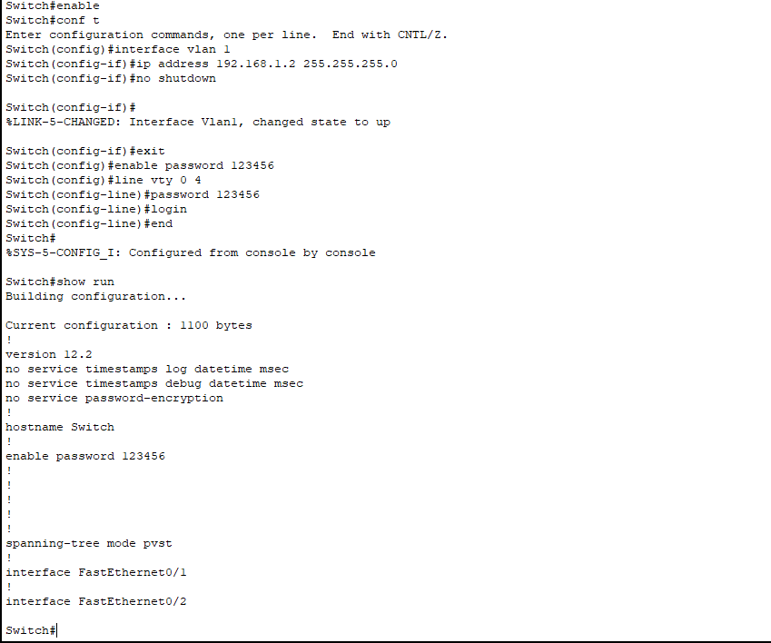

# 交换机的Telnet远程登录配置

## 配置线的"rs-232"端口连接交换机的”console“口

## 通过PC终端对交换机进行配置

## 直连线连接pc和路由器

## 使用pc端**命令行**连接（找到pc的command promnt）

## 总结

- 进入特权模式（en/enable）
- 进入全局配置模式（conf t）config terminal
- 进入交换机端口视图模式int f 0/1
- 返回到上级模式（exit）
- 从全局以下模式返回到特权模式（end）

- siwtch(config)#line vty 0 4 配置远程登陆的线路

  line vty 0 4，该命令是允许用户远程登陆，即不用用户插Console线缆，只要设备连接网络，配置了接口IP地址即可远程使用Telnet、或者ssh的方式登陆到设备上，，CISCO设备一般支持16个并行的远程虚拟终端，按照编号就是：0 - 15.， Line vty 0 4 就是指同时允许5个虚拟终端登陆进行配置,需注意这里配置完成后一定要注意配置enable的密码，要不Telnet是上不去的。

- Switch(config)# enable password ****** //设置进入特权模式的密码
  Switch(config-line)# password ******  #远程登录密码

- siwtch(config-line)#login 用于打开登录认证

- siwtch(config-line)#password  ** //设置远程登陆的密码

enable 进入特权模式

