# 单臂路由的配置实现不同VLAN间通信

## 建立如图所示拓扑结构

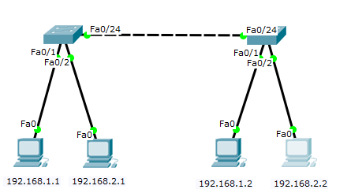

## 创建VLAN并配置交换机端口

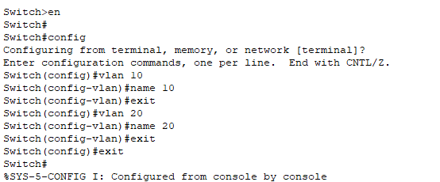

## 查看vlan

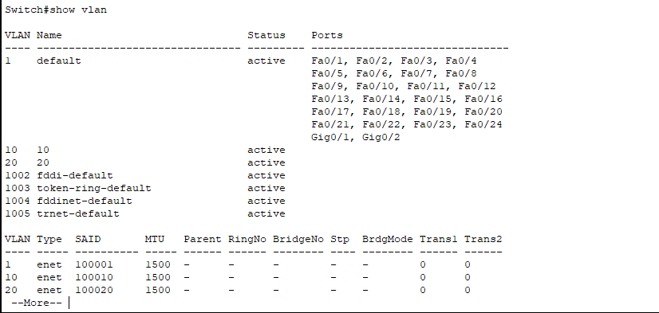

## 为vlan划分接口

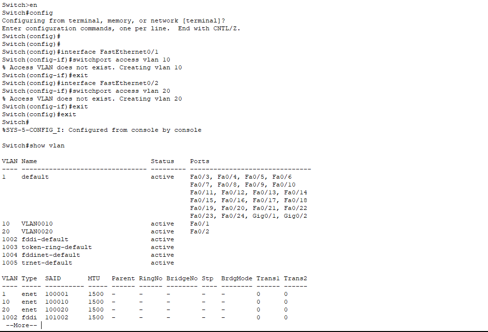

## 把交换机sw1,sw2的Fa0/24接口设置为trunk模式

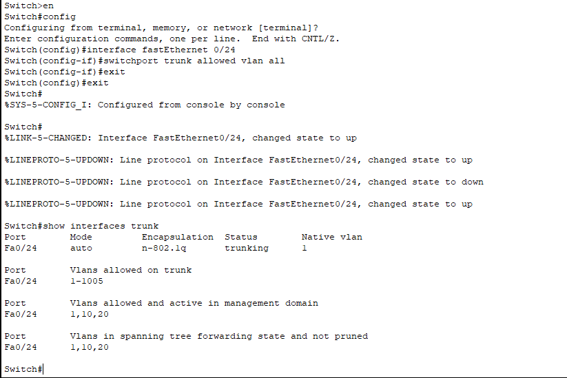

## 此阶段完成后，相同网段之间的主机可以通信

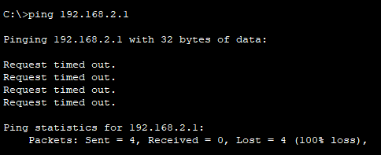

## 为拓扑结构增加一个路由器

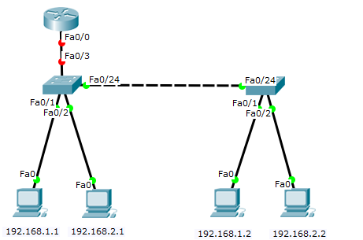

## 设置路由器名称，划分子接口，封装vlan10，vlan20，为子接口划分ip地址，开通物理接口。

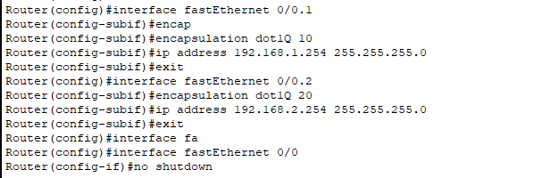

## 查看

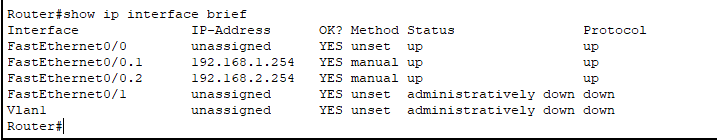

## 为接口Fa0/3设置trunk模式

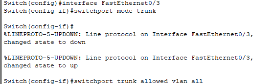

## 此阶段完成时，所有主机之间均能实现通信。

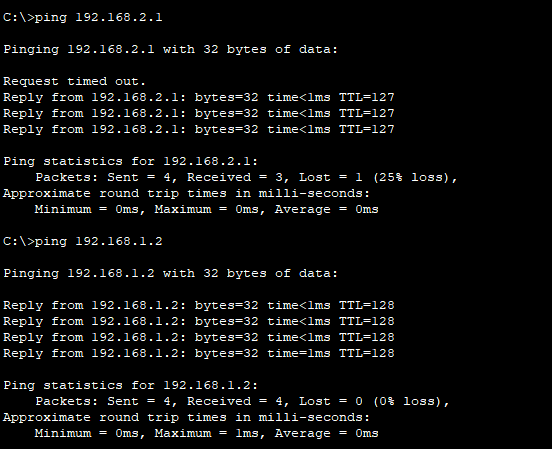